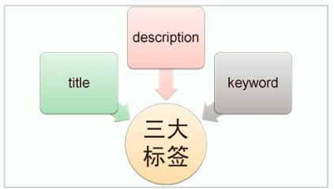
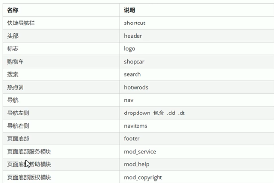
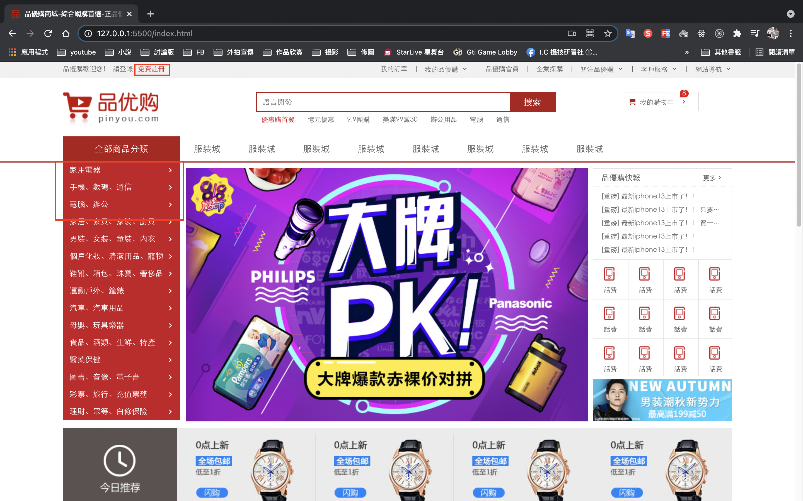
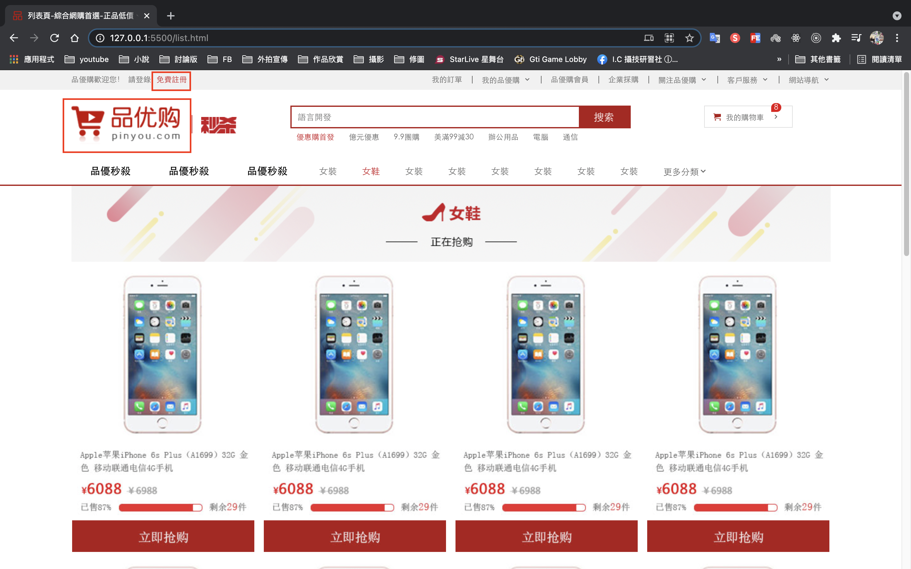
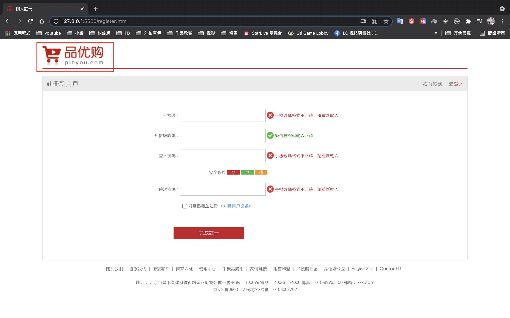

# HTML CSS 品優購 網頁製作

# Github展示

本網頁為學習使用，若有侵權請告知，謝謝！

https://ivesshe.github.io/HTML_CSS_Web_PinYouGo/


# 網站TDK三大標籤SEO優化

- SEO(Search Engine Optimization)翻譯為搜索引擎優化，是一種利用搜索引擎的規則提高網站在有關搜索引擎內自然排名的方式。

- SEO的目的是對網站進行深度的優化，從而幫助網站獲取免費的流量，進而在搜尋引擎上提升網站的排名，提高網站的知名度。

- 頁面必須有三個標籤用來符合SEO優化



## title網站標題

title具有不可替代性，是內頁的第一個重要標籤，是搜索引擎了解網頁的入口和對網頁主是歸屬的最佳判斷點。

建議∶ 網站名(產品名) - 網站的介紹 (盡量不要超過30個字)

```html
<title>品優購商城-綜合網購首選-正品低價、品質保證、配送及時、輕鬆購物</title>
```

## description網站說明

簡要說明網站的主要是作什麼的

```html
<!-- 網站說明 -->
<meta name="description" content="品優購商城-專業的綜合網上購物商城，鎖售家電、數碼通訊、電腦、家居百貨、服裝服飾、母嬰、圖書、食品等數萬個品牌優質商品、便捷、誠信的服務，為您提供愉稅的網上購物體驗 " />
```

## keywords關鍵字

- keywords是頁面關鍵詞，是搜索引擎的關主點之一

- keywords最好限制為6-8個關鍵詞，關鍵詞之間用英文逗號隔開，採用關鍵詞1、關鍵詞2的形成

```html
<!-- 關鍵字 -->
<meta name="keywords" content="網上購物,網上商城,手機,筆記本,電腦,MP3,CD,VCD,DV,相機,數碼,配件,手錶,存儲卡,京東" />
```

# 模塊命名參考



# LOGO SEO優化

1. logo裡面首先放一個h1標籤，目的是為了提權，告訴搜索引擎，這個地方很重要。

2. h1裡面再放一個鏈接，可以返回首頁的，把logo的背景圖片給鏈接即可。

3. 為了搜索引擎收錄我們，我們鏈接裡面要放文字(網站名稱)，但是文字不要顯示出來。
    - 方法1∶ text-indent移到盒子外面(text-indent: -9999px)，然後overflow:hidden，淘寶的作法
    - 方法2∶ 直接給font-size:0; 就看不到文字了，京東的作法

4. 最後給鏈接一個title屬性，這樣鼠標放到logo上就可以看到提示文字了

# 完成畫面

紅框標示可按連結

## index.html



## list.html



## register.html



    
    
    